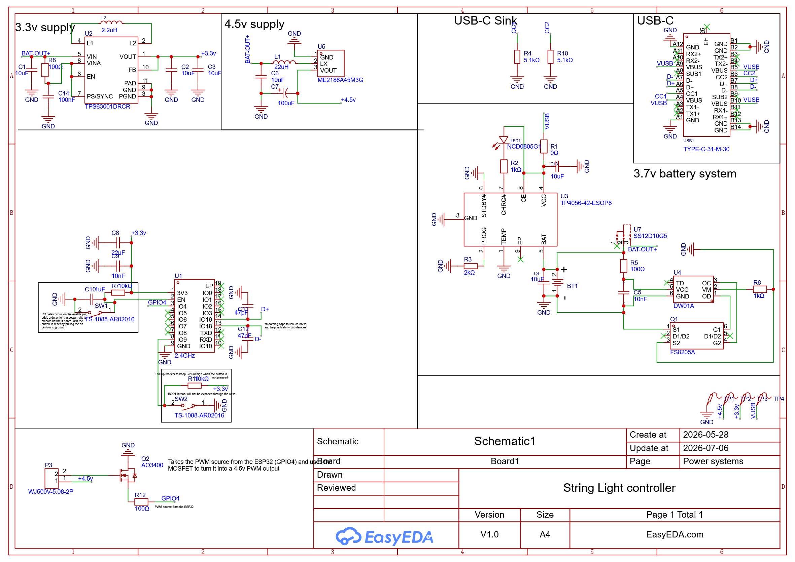

# String-light-controller

an esp-home controller for 4.5V string-lights with PWM dimming and a battery with USB-C recharging.
comes in a version with an 18650 battery holder and a version with a JST PH connector. The JST version is more compact




## ESP-home implementation

the lights can be controlled using the ESP-home "component" [ESP-32 LEDC output](https://esphome.io/components/output/ledc/).
it allows for the easy creation of a HomeAssistant light entity with dimming based on the PWM output of the esp32 through basic yaml configuration files, that automatically generate the code needed to flash the ESP32, and allow you to flash it through ESP-home web tools.
to define a light using this component, all you **need** to declare in your ESP-home config is the pin on the esp32 (in the case of this board, GPIO4) and the ID that you want the light component to have in HomeAssistant. You can also set the PWM frequency of the pin, the ESP32-C3 which is used in this board only supports 14 bit LEDC timers, as shown on the frequency table on the ESP-home docs page i linked.
Here is an example configuation:

``` yaml
# Example configuration entry
output:
  - platform: ledc
    pin: GPIOXX
    id: gpio_

# Example usage in a light
light:
  - platform: monochromatic
    output: gpio_19
    name: "Kitchen Light"
```

## Operation

The board features an ESP32-C3 to interface with the PWM pin at GPIO4, which is then transformed through the MOSFET (Q2) into a 4.5v PWM signal.
The PWM output can be used to change the brightness of the lights, and can be easily controled through esp-home to turn any 4.5v string lights into smart-lights with HomeAssistant!
String lights that use 3 AA or AAA batteries often operate at 4.5v and should be compatible with this board.

## Assembly
[go to assembly](Assembly.md)

# BATTERY DISCLAIMER !!!
LiPo and LiIon batteries are **pretty dangerous**!! 
I **DO NOT** take responsibility for my battery charging or management circuitry being responsible for your battery being over/under charged and setting on fire.
I trust my circuitry enough to use it in my own home, but you should always look over someone else's circuitry yourself and do your due diligence!
**Use at your own risk!!**

